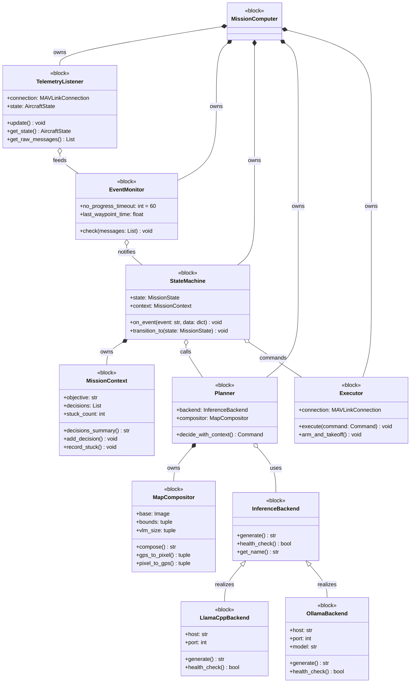
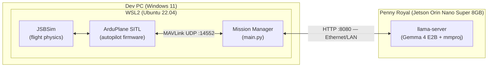

# Block Definition Document

## Document Control
- Version: 0.1
- Status: Draft
- Applies to: SITL simulation phase only
- Last updated: 2026-05-07

## System Context

The LLM-UAV Mission Computer sits between the autopilot and the VLM inference engine. It translates autopilot telemetry into visual context for the VLM, and translates VLM decisions into MAVLink commands for the autopilot.

## SysML Block Definition Diagram

> **Note:** This diagram is a SysML Block Definition Diagram (BDD) expressed in Mermaid `classDiagram` notation for toolchain compatibility (GitHub, VS Code, and most markdown renderers display Mermaid natively). The `<<block>>` stereotypes, composition (`*--`), aggregation (`o--`), and generalization (`<|--`) relationships follow standard SysML semantics. When a formal SysML authoring tool (e.g. Cameo, Eclipse Papyrus, or a SysML v2 textual tool) is introduced into the workflow, the canonical `.sysml` source should be generated from this diagram and this Mermaid representation should be regenerated from the `.sysml` source as the rendered view.

## Hardware Block Diagram (SITL Phase)

The diagram below shows the physical deployment for the current SITL phase. The autopilot is virtualized inside WSL2 on the Dev PC; the VLM inference server runs on a separate physical Jetson box on the same LAN.

**Notes:**
- Dev PC and Penny Royal are physically separate machines on the same Ethernet/LAN segment. Penny Royal is reachable at `192.168.1.177`.
- The autopilot is a virtualized ArduPlane SITL process inside WSL2 — there is no physical autopilot, RC link, or airframe in this phase.
- The MAVLink interface is loopback-style inside WSL2 (UDP `localhost:14552`); only the HTTP inference link crosses the physical LAN.
- This diagram must be updated before HIL or real-flight testing — the Mission Manager moves onto the airframe, the autopilot becomes physical hardware, and a radio link replaces the loopback MAVLink UDP socket.

## Block Definitions

### BLK-001: TelemetryListener
**Responsibility:** Owns the MAVLink connection. Drains all messages each tick. Maintains current aircraft state.
**Inputs:** MAVLink UDP stream from autopilot
**Outputs:** Aircraft state dict (lat, lon, alt, heading, airspeed, mode, armed), raw message buffer
**Key attributes:** Single owner of MAVLink connection — no other block reads from the connection directly

### BLK-002: EventMonitor
**Responsibility:** Detects meaningful events from the MAVLink message stream and fires them to the StateMachine.
**Inputs:** Raw message buffer from TelemetryListener
**Outputs:** Events (waypoint_reached, altitude_reached, mode_changed, no_progress)
**Key attributes:** Does not own MAVLink connection. Tracks time since last waypoint for no_progress detection.

### BLK-003: StateMachine
**Responsibility:** FSM engine. Maintains mission state. Calls Planner at decision points. Calls Executor with decisions.
**Inputs:** Events from EventMonitor
**Outputs:** Commands to Executor, context updates to MissionContext
**Key attributes:** Only block that calls Planner. Owns state transitions.

### BLK-004: MissionContext
**Responsibility:** Accumulates mission memory across the flight. Provides decision history to Planner.
**Inputs:** Decision records from StateMachine
**Outputs:** decisions_summary(), waypoints_summary() for prompt population
**Key attributes:** Persistent across the mission. Provides LLM episodic memory.

### BLK-005: Planner
**Responsibility:** Generates map image, loads prompt template, calls inference backend, parses response.
**Inputs:** Aircraft state, MissionContext, event type
**Outputs:** Command dict (command, reasoning, params)
**Key attributes:** Owns MapCompositor. Loads prompt from file per event type. Falls back to RTL on any error.

### BLK-006: MapCompositor
**Responsibility:** Draws aircraft position, heading, trail, and mission markers onto base map tile. Encodes as base64 PNG.
**Inputs:** Aircraft state, mission target coordinates, map tile
**Outputs:** base64 PNG image string
**Key attributes:** Saves debug images per call. Stores last bounds for pixel_to_gps conversion.

### BLK-007: InferenceBackend (abstract)
**Responsibility:** Sends prompt and image to VLM inference server. Returns raw text response.
**Inputs:** System prompt, user prompt, base64 image
**Outputs:** Raw text response string
**Key attributes:** Pluggable — concrete implementations for llama.cpp, Ollama, TensorRT. Selected via INFERENCE_BACKEND env var.

### BLK-008: Executor
**Responsibility:** Translates command dicts into MAVLink commands. Handles pixel-to-GPS conversion.
**Inputs:** Command dict from StateMachine
**Outputs:** MAVLink commands to autopilot
**Key attributes:** Owns pixel_to_gps conversion via MapCompositor reference. Clamps pixel coordinates to valid range.
