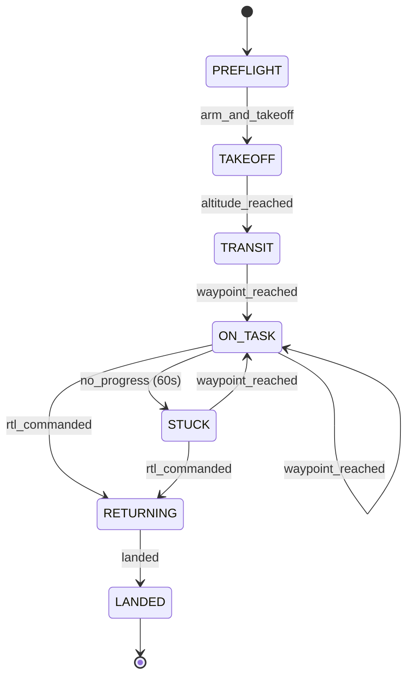

# State Machine Specification

## Document Control
- Version: 0.1
- Status: Draft
- Applies to: SITL simulation phase only
- Last updated: 2026-05-07

## State Diagram

## State Definitions

| State | Description |
|---|---|
| PREFLIGHT | System initialized, aircraft on ground, awaiting arm command |
| TAKEOFF | Aircraft armed and climbing to cruise altitude |
| TRANSIT | Aircraft at cruise altitude, flying to first mission waypoint |
| ON_TASK | Aircraft executing mission, LLM called at each waypoint_reached event |
| STUCK | Aircraft has made no waypoint progress for 60 seconds, LLM reassessing |
| RETURNING | RTL commanded, aircraft returning to launch point |
| LANDED | Aircraft on ground, mission complete |

## Event Definitions

| Event | Source | Trigger |
|---|---|---|
| arm_and_takeoff | main.py | Called at startup after backend health check |
| altitude_reached | EventMonitor | GLOBAL_POSITION_INT alt crosses 50m threshold |
| waypoint_reached | EventMonitor | MISSION_ITEM_REACHED MAVLink message received |
| no_progress | EventMonitor | 60 seconds elapsed since last waypoint_reached while airborne |
| rtl_commanded | StateMachine | LLM returns {"command": "rtl"} at any decision point |
| mode_changed | EventMonitor | HEARTBEAT custom_mode changes |
| landed | StateMachine | mode_changed to LAND mode while RETURNING |

## LLM Decision Points

The LLM is called at these state transitions only:

| Trigger state | Event | Prompt file |
|---|---|---|
| TRANSIT | waypoint_reached (first) | transit_started.txt |
| ON_TASK | waypoint_reached | waypoint_reached.txt |
| STUCK | (on entry) | stuck.txt |

The first LLM call (the TRANSIT → ON_TASK transition, fired by the `transit_started` event at cruise altitude) also captures the aircraft's pixel position into `MissionContext.start_pixel_x` / `start_pixel_y`. The capture is idempotent — once set, the start position is immutable and is exposed to all subsequent prompts as `{start_pixel_x}` / `{start_pixel_y}` so the model can reason about "am I back near where I started" without coordinate arithmetic.

## Fallback Behavior

All LLM decision points fall back to RTL on:
- JSON parse error
- HTTP timeout after one retry
- Map composition failure
- Any unhandled exception
