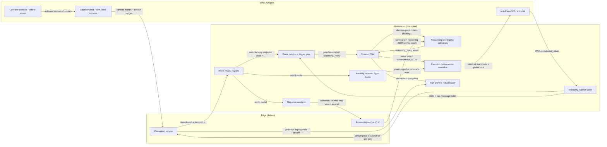

# System Architecture — V2.0 ("Sight" Increment)

## Document Control
- Version: 0.1
- Status: Draft
- Applies to: V2.0 increment, SITL + Gazebo simulation phase only
- Last updated: 2026-05-08

> Third left-arm artifact of the V2.0 increment, derived from the L0 requirements ([L0_requirements.md](L0_requirements.md)) and the ConOps ([conops.md](conops.md)). It selects and specifies the system architecture. The selected architecture — **Sentinel-Spine** — was chosen from a five-candidate paradigm-divergent exploration (see [architecture_options.pdf](architecture_options.pdf)); the selection rationale is in §9 and the full L0 allocation for the two invariant-clean finalists is in [l0_allocation.html](l0_allocation.html).

---

## 1. Selected Architecture — Sentinel-Spine

**Paradigm: extended finite-state machine / minimal-process.** Sentinel-Spine keeps the proven V1 control loop as the flight-safety/mission **spine** and pushes everything with unbounded or variable latency off that spine into separate edge processes.

The spine is one process, one thread, on the workstation, looping telemetry ingest -> event check at a fixed rate, draining MAVLink and emitting MAVLink. It is the **sole MAVLink owner** and the only component that can command flight. Perception and reasoning run as **separate OS processes on the edge**; the spine reads their output through a **non-blocking, latest-value snapshot**, so the drain never waits on them. The world-model registry is kept **on the spine's side** (in-process), so a perception crash can degrade to "no detections" without corrupting mission state.

This is the smallest credible delta from a verified-working baseline: the safety path is essentially the V1 loop, minimizing regression risk while structurally firewalling perception. It was the only candidate with zero invariant violations, and scored highest on simplicity and sim/real cleanliness while tying for top on fault isolation.

## 2. Hardware & Tier Layout

Two machines (the flight stack would move onboard a real airframe unchanged; the simulation side is replaced by reality):

- **Workstation (dev PC).** Gazebo (physics/FDM + sensor rendering), ArduPlane SITL (autopilot), MAVProxy, and the **Mission Manager spine** (telemetry, event gate, state machine, executor + observation controller, the in-process registry, and the map renderers).
- **Edge (Jetson Orin Nano, 8 GB) — the flight stack.** The **perception service** (detector -> tracker -> geo-projector) and the **reasoning service** (llama-server / Gemma 4 E2B) as two independent processes sharing the edge budget.

Links: MAVLink UDP (autopilot <-> spine, loopback on the workstation), the camera-frame stream (Gazebo -> edge perception), and HTTP (spine <-> edge for the perception snapshot, the map view, and the decision).

## 3. Component Decomposition

| Component | Tier | Responsibility |
|---|---|---|
| Gazebo world + simulated sensors | sim | External to the stack. Provides the 3D world, the gimbaled camera frame stream, boresight rangefinder, nadir altimeter, and the gimbal plant; hosts authored scenarios. Replaced by reality with no change inside the stack. Allocated (as external actor satisfying): SIM-02, SIM-03, frame side of IFC-01. |
| ArduPlane SITL (autopilot) | sim | External to the stack. Owns flight control; speaks MAVLink. The stack delegates all low-level control here (SAF-01). Replaced by a real autopilot with no change inside the stack (IFC-02). |
| Operator console + offline scorer | sim | External. Authors scenarios/objective, arms/aborts (SAF-07), and runs the held-out scoring path comparing perceived world-state + action outcomes against authored ground-truth strictly OFFLINE — truth never enters the stack (INT-01). Allocated: SIM-04, SAF-07, MIS-01 objective entry. |
| Telemetry listener (spine) | workstation | The single owner of the MAVLink connection. Drains all pending messages each 10 Hz tick into a current-state dict (lat/lon/alt/heading/airspeed/mode/armed) and a raw-message buffer. Unchanged from V1 — this IS the single-owner property that SAF-03 protects. Allocated: IFC-01 (only it reads/writes MAVLink), SAF-03. |
| Event monitor + trigger gate | workstation | Derives events from the telemetry buffer (altitude_reached, waypoint_reached, mode_changed, no_progress) AND, new in V2, polls the registry snapshot to raise detection / track_lost / observation_ended / feature_unconfirmed / reasoning_ready events. Applies the mission-state admissibility gate to detection interrupts before they reach the FSM. Allocated: EVT-01/02/03, NAV-05 surfacing, PER-06 staleness honored at read time. |
| Mission FSM | workstation | The extended V1 state machine (PREFLIGHT->TAKEOFF->TRANSIT->ON_TASK<->STUCK->RETURNING->LANDED, plus an OBSERVING sub-state under ON_TASK). Routes events to handle_<event> methods by reflection (V1 mechanism kept). Decides when reasoning is due and fires a NON-BLOCKING reasoning request; consumes reasoning_ready as an event. Holds the V1 auto-RTL/boundary heuristics. Allocated: MIS-04, MIS-06, EVT gating dispatch, SAF-05 fallback orchestration, ACT-03 re-observation bound. |
| Reasoning client (spine-side proxy) | workstation | Thin spine-side stub for the VLM. On a decision point it renders the map view, fires prompt+image to the edge Reasoning service without blocking the loop, tracks the in-flight request, and on completion emits reasoning_ready carrying the parsed command+reasoning (RTL fallback on parse/timeout/HTTP error). This is the component that moves V1's blocking call off the hot thread. Allocated: MIS-02, MIS-03, MIS-05 (sends only the map view), MIS-07 context assembly, SAF-05/06 reasoning-health. |
| World-model registry | workstation | Single in-process object owning mission/world state: decision history + scratchpad (V1 MissionContext, kept) AND the perception world model — tracks with unique IDs, kinematic state, per-track position covariance, TTL/staleness flags, latest feature-confirm verdict, plus the prior-map substrate. Updated by ingesting perception's published snapshot; read by the renderers, executor, and gate. Owned and mutated only by the spine thread (no cross-thread locking). Allocated: PER-04/05/06/07 representation, INT-01 (only legitimately-earned content), MAP-01 substrate, MIS-07. |
| NavMap renderer / geo frame | workstation | Full-fidelity rendering of the registry: real geometry and the pixel<->gps conversion (V1 MapCompositor's coordinate role, kept and isolated). Serves the executor's pixel->gps and any coordinate math. Never seen by the VLM. Allocated: MAP-04, NAV coordinate execution, MAP-01. |
| Map-view renderer | workstation | Deliberately-schematic, high-contrast, VECTOR rendering from map-data primitives (roads as clean lines, labels for prior-map features + perception-confirmed detections only, label layer toggleable on/off, axes/compass/aircraft mark). The ONLY artifact handed to the VLM. Allocated: MAP-02, MAP-03a, MAP-03b, MIS-05. |
| Executor + observation controller | workstation | Translates FSM/VLM intent to MAVLink (goto_pixel/goto_waypoint/loiter/rtl from V1) AND runs the delegated observation loop: expands observe{track_id} into an orbit re-centered each tick on the registry's live track position and the matching gimbal-pointing MAVLink command, with a bounded termination condition. Fails safe (hold last orbit) + escalates if the registry feed dies mid-observation. Sole emitter of MAVLink besides telemetry. Allocated: SAF-01, SAF-08, TSK-02/03/04/06, ACT loop closure execution, NAV-03 command issue. |
| Run archive + dual logger | workstation | Per-run archiving (V1 philosophy extended): decision log with reasoning, perception/detection log written SEPARATELY, the imagery the VLM reasoned over, mission config, and per-target validate/reject/inconclusive outcomes — all timestamped to a shared clock for time-alignment. Allocated: LOG-01/02/03/04. |
| Perception service | edge | Continuous own-process pipeline on the edge: owns the inbound camera-frame stream and the boresight rangefinder + nadir altimeter; runs detect/classify/track; runs the geo-projector (boresight range along LOS for the gimbal-centered target, nadir-AGL ground-plane fallback for off-axis) fusing aircraft pose pulled from the spine; confirms prior-map features against the camera view. Publishes a latest-value snapshot; never holds a MAVLink handle. Allocated: PER-01/02/03/08/09/10/11, the producing side of PER-04/05/07. |
| Reasoning service (VLM) | edge | Event-driven own-process llama-server hosting the 2B VLM (V1 llama.cpp deployment, kept). Receives prompt + schematic map view, returns the structured command + reasoning JSON. Co-resident with perception under the shared 8GB edge budget. Allocated: MIS-02 inference, runtime side of MIS-03/MIS-05. |

### Component & data-flow diagram

## 4. Data Flows & Interfaces

- **MAVLink (autopilot <-> spine).** Telemetry in (the aircraft's own state — GPS, attitude, mode); commands out (GUIDED / LOITER / gimbal ROI / RTL). The spine's telemetry listener is the sole reader; the executor is the sole emitter.
- **Camera-frame stream (Gazebo -> edge perception).** Raw frames terminate inside the edge perception process; they never traverse the spine and are never sent to the VLM.
- **HTTP (spine <-> edge).** Perception publishes a latest-value snapshot (tracks, detections, uncertainty, feature-confirmation) that the spine ingests each tick; the spine sends the rendered schematic map view + accumulated context to the VLM; the VLM returns a structured command + reasoning.

## 5. Fault Domains & Degradation

Three isolated domains:

1. **Safety spine (workstation, one process/thread)** — telemetry, event gate, FSM, executor, registry, renderers. It is the only MAVLink emitter; it is kept minimal and synchronous. If it dies, the mission ends — so it carries no variable-latency work.
2. **Perception (edge process)** — a crash or stall stops the snapshot from advancing; the spine reads "no detections" and continues navigating on GPS + the prior map (SAF-04). Raw frames and heavy compute are contained here.
3. **Reasoning (edge process)** — llama-server; a failure or timeout triggers the spine's RTL/safe-default fallback (SAF-05).

The firewall is **topological**: perception holds no MAVLink handle and the spine reads it only through a non-blocking snapshot, so neither perception's load nor its failure can stall the drain (SAF-03).

## 6. Deferred Design Decisions — Resolved

The design decisions the ConOps and L0 deliberately left open are resolved as follows:

| Decision | Resolution in Sentinel-Spine |
|---|---|
| Component decomposition | Two new edge OS processes (Perception, Reasoning) plus an in-process registry+renderer subsystem added to the otherwise-unchanged V1 spine. The V1 components (telemetry, event_monitor, state_machine, executor, mission_context, map_compositor) are kept by name and role; map_compositor splits into a NavMap renderer (geometry) and a Map-view renderer (schematic). The only structural change to the spine is moving the VLM call off the hot thread via a Reasoning client proxy. No new processes on the workstation, no thread pool, no message broker — the minimum that firewalls perception+reasoning while preserving the single-owner loop. |
| World-model / registry placement | Single in-process Python object owned exclusively by the spine thread (an extended MissionContext). Access pattern: WRITE only by the spine when it ingests perception's published snapshot at the top of a loop tick; READ by the gate, renderers, and executor within the same thread. No locks, no shared-memory races — cross-process data enters only through the perception snapshot read. Perception keeps its own short-lived working track state in its own process; the spine's registry is the authoritative mission-facing copy. This keeps the world model on the safe side of the process boundary so a perception crash cannot corrupt it. |
| Process / IPC topology | Spine + NavMap/map-view renderers + registry on the WORKSTATION (in the Mission Manager process). Perception and Reasoning on the EDGE as two separate processes sharing the 8GB budget. Transport between workstation and edge is HTTP/loopback-style request-response over the LAN, but used in a strictly NON-BLOCKING, latest-value way from the spine: perception->registry is a publish the spine polls (read newest, drop stale, never wait); FSM->reasoning is fire-and-collect (request returns immediately, result arrives as an event). One non-blocking socket read per loop iteration; the 10 Hz drain is never gated on a remote response. |
| Camera frame transport | Camera frames + the co-aligned rangefinder/altimeter ranges flow Gazebo -> Perception service ONLY, terminating inside the edge. Frames never traverse the spine and never reach the workstation in the steady loop. This is deliberate: it keeps the heavy stream off the safety path entirely and honors MIS-05 (the VLM never gets raw frames) structurally — there is no code path by which a raw frame can reach either the FSM or the VLM. Imagery is copied to the run archive out-of-band for post-run review (LOG-03), not through the live loop. |
| Gimbal command path | Gimbal pointing is a flight-tier command issued by the spine's executor over MAVLink to the autopilot/sim gimbal plant — the SAME channel as nav commands. It does NOT route through perception. The observation controller computes the pointing from the registry's live track geodetic position and the aircraft pose; perception only reports where the target IS (a track), never commands where the gimbal goes. This keeps the closed-loop pointing deterministic and on the trusted MAVLink path, and means a perception fault degrades pointing to 'hold last commanded orbit' (SAF-08) rather than sending the gimbal somewhere unsafe. |
| Map-rendering pipeline | Two renderers off one registry, per the two-map rule. NavMap: full-fidelity geometry + pixel<->gps, consumed by the executor/geo-projection, never shown to the VLM (MAP-04). Map view: schematic vector primitives, clean high-contrast road lines, labels restricted to legitimately-known features (prior-map + perception-confirmed) with a toggleable label layer for with/without-labels experiments (MAP-02/03a/03b). Rendering happens on the workstation; only the finished map-view image crosses to the edge Reasoning service. |
| Geo-projector placement | Lives INSIDE the perception service on the edge, co-located with the detector that produces the pixel detections and with the rangefinder/altimeter feeds it fuses. It pulls aircraft pose from the spine's published pose snapshot. Rationale: geo-projection is part of 'earning' world knowledge from sensors (INT-01) and must run at perception cadence, not decision cadence — placing it on the edge keeps the frame+range data local and keeps the workstation registry receiving already-geodetic, covariance-tagged tracks. Boresight range collapses the gimbal-centered target to ray+range; nadir AGL backs off-axis ground-plane fallback (PER-10/11). |
| Observation / orbit control | A deterministic module of the spine's executor (NOT the VLM, NOT perception). The VLM issues one symbolic observe{track_id} intent (TSK-07) and exits the loop; the controller runs orbit-and-hold closed-loop, re-centering each tick on the registry's live track position (TSK-02/03), enforces a bounded termination condition guaranteed to fire (TSK-04), allows at most one concurrent observation (TSK-06), and on target-lost/un-observable/feed-loss raises an escalation event back to the FSM (TSK-05, SAF-08) — the STUCK pattern reused. The orbit control loop is thus a spine concern; only its start/stop/outcome touch the VLM. |
| Fault-domain boundaries | Three isolated domains. (1) SAFETY SPINE (workstation, one process/thread): telemetry+gate+FSM+executor+registry+renderers; if this dies the mission dies, so it is kept minimal and synchronous and is the only MAVLink emitter. (2) PERCEPTION (edge process): crash/stall/silence -> snapshot stops advancing -> gate reads 'no detections' -> SAF-04 degrade; cannot touch MAVLink or corrupt the registry (writes only via the snapshot the spine chooses to read). (3) REASONING (edge process): timeout/parse-fail/unreachable -> Reasoning client emits RTL fallback (SAF-05); because the call is off-spine, a slow VLM cannot stall the drain (SAF-03). Boundaries are OS-process + non-blocking-read; the sim/real boundary (MAVLink + frame streams) wraps all three so swapping Gazebo/SITL for reality changes nothing inside (IFC-02). |

## 7. Required Hardening (before baselining)

The architecture review found Sentinel-Spine sound but identified three mandatory hardening grafts — each borrows the one good idea from a rejected candidate without importing its paradigm:

- **Graft A — de-block the executor (highest priority).** The inherited V1 executor blocks the spine (~1 s before each mode-set; ~16 s on arm). The mode-set/sleep handshake MUST become non-blocking (issue the mode-set, confirm on the next telemetry tick, never sleep on the spine) — otherwise the per-tick orbit re-center stalls the drain during observation.
- **Graft B — spine-resident observation watchdog.** A termination timer + feed-staleness watchdog on the spine that fires `observation_ended` / `track_lost` **independent of the perception feed**, so a whole-perception-domain death still terminates the orbit. Closes SAF-08.
- **Graft C — first-class `reasoning_ready` event with an in-flight-overlap policy.** At most one in-flight reasoning request; a newer high-priority trigger supersedes a stale one; a `reasoning_ready` whose context is no longer current is dropped; the FSM holds a defined safe default during the request window.

Also close before baseline (allocation thinness, not violations): draw the `observation_ended -> validate/reject/inconclusive` verdict cycle explicitly (ACT-01); and assign an owner that blocks arming on a missing **perception** heartbeat at preflight (SAF-06 — reasoning-health is allocated, perception-health is not).

## 8. Honest Residual

During an active observation the aircraft orbit and gimbal pointing are closed around a perception-derived track position. This is **sanctioned** by TSK-02/03 and ConOps §6 (delegated control) and is **not** a SAF-02 violation — perception issues no MAVLink; the executor commands. But it is the one place the "perception is out of the flight loop" narrative legitimately leaks, and the design documentation states so plainly rather than claiming perception is never in the loop.

## 9. Selection Rationale (summary)

Five paradigm-divergent architectures were generated and adversarially judged against the L0 invariants. Three (dataflow, service-oriented, actor/bus) were disqualified for invariant violations as drawn. Of the two invariant-clean finalists, **Skywriter** (two-blackboard) is over-engineered for a single-Jetson research rig — 17 components, two hosts, replication plumbing, and the worst edge-memory contention — while achieving the *same* top fault-isolation score as Sentinel-Spine. **Sentinel-Spine** delivers that top-tier isolation with the fewest moving parts, the cleanest sim/real boundary, and the least regression risk against proven V1 behavior. Full side-by-side allocation: [l0_allocation.html](l0_allocation.html).

## 10. Open Decisions (carried forward)

1. **Edge-budget feasibility gate (SIM-01) — measure now.** Every surviving design assumes perception + llama-server co-resident in 8 GB. Run a resident-set measurement of the perception pipeline alongside the 2B VLM before committing. If it OOMs, the single-edge-box assumption breaks (smaller perception model / NVMe, or a second edge unit — which converts the in-process registry write into a network write and erodes the simplicity advantage). **This measurement could change the ranking.**
2. **Gimbal command path — confirm MAVLink.** Confirm at L1 that gimbal/mount control rides MAVLink (mount / gimbal-manager protocol) on real hardware, so IFC-02 "no change inside the stack" holds.
3. **Latency / threshold numbers.** Set and validate the numeric thresholds the single gate seam consumes — detection-interrupt confidence (EVT-01), staleness/TTL (PER-06), non-confirmation persistence (NAV-05/TSK-05), slow-mover bound (PER-07) — against slow-mover dynamics before enabling active pointing.
4. **Spine concentration risk.** Registry + both renderers + observation controller live in the one spine process; a bug there is a flight-safety bug and there is no hot standby (acceptable for SITL, not a real airframe). Decide the internal module discipline and confirm the RTL-fallback default covers spine-internal faults.
5. **Validate / reject / inconclusive criteria (ACT-01).** The research payload of V2 — decide who owns defining the three outcomes (prompt engineering + scoring harness); the held-out scorer (INT-01) depends on it.

---

## Appendix A — L0 Requirements Allocation

How each of the 62 L0 requirements is realized in Sentinel-Spine. (Items marked TBD/L1 are deferred bounds carried in the L0 Open Items list, not gaps.)

| ID | Requirement | Realized by (component / mechanism) |
|---|---|---|
| L0-MIS-01 | Execute missions from a natural-language objective | Operator console enters the NL objective; Reasoning client assembles it into the prompt fired to the VLM. External-actor entry point. |
| L0-MIS-02 | Use a VLM as mission decision authority | Edge Reasoning service (llama-server/Gemma 4 E2B) performs inference; spine-side Reasoning client proxies it. Event-driven only. |
| L0-MIS-03 | Decisions as structured commands with reasoning field | Reasoning service returns structured command+reasoning JSON; Reasoning client parses and carries it, falling back to RTL on parse failure. |
| L0-MIS-04 | Maintain mission state across a flight | Mission FSM holds the PREFLIGHT..LANDED lifecycle; world-model registry stores decision history/scratchpad, all owned by the single spine thread. |
| L0-MIS-05 | Reason over distilled map view, never raw frames | Map-view renderer produces the schematic vector view (only artifact the VLM sees); frames terminate in the edge Perception service, no path to VLM. |
| L0-MIS-06 | Invoke reasoning at decision points, not on a timer | Mission FSM decides when reasoning is due and fires a non-blocking request; VLM off the hot thread, woken by events only. |
| L0-MIS-07 | Provide accumulated context at each invocation | Reasoning client assembles accumulated context; world-model registry (extended MissionContext) holds accumulated decision history it draws from. |
| L0-MIS-08 | Autonomously RTL/land when objective satisfied | Reasoning service emits RTL on completion; spine Executor executes the RTL. Completion criterion deferred to L1. |
| L0-PER-01 | Continuously perceive from camera, independent of reasoning cadence. | The edge Perception service owns the frame stream and runs its detector continuously at its own cadence, decoupled from the spine. |
| L0-PER-02 | Detect and classify targets/landmarks with class and confidence. | The Perception service runs detect/classify/track, assigning class and confidence. |
| L0-PER-03 | Geo-locate detections into geodetic coordinates from sensor and pose. | The geo-projector inside the edge Perception service fuses sensor data with aircraft pose pulled from the spine's pose snapshot. |
| L0-PER-04 | Maintain persistent, uniquely identified tracks for entities. | Perception produces tracks; the spine's single in-process World-model registry holds/persists uniquely-IDed tracks as the authoritative mission-facing copy. |
| L0-PER-05 | Represent position uncertainty; never present uncertain as exact. | Perception produces tracks-with-covariance; the spine's registry stores per-track position covariance so uncertainty is preserved. |
| L0-PER-06 | Expire or flag stale tracks using bounded staleness threshold. | The spine's registry holds TTL/staleness flags; the event monitor honors staleness at read time. Threshold is L1 config on the gate/registry. |
| L0-PER-07 | Estimate velocity for tracked targets within slow-mover bound. | The edge Perception service produces kinematic state; the spine's registry represents it. Slow-mover bound is TBD at L1. |
| L0-PER-08 | Geo-location accuracy meets bound sufficient for reasoning. | The geo-projector in the edge Perception service produces the accuracy; the bound value is TBD, derived at L1. |
| L0-PER-09 | Confirm prior-map features against camera; confirmed-or-not result. | The Perception service confirms prior-map features against the camera view, publishing a feature-confirm verdict in its snapshot. |
| L0-PER-10 | Geo-locate gimbal-centered target via boresight range, no flat-ground assumption. | The geo-projector uses boresight range along the LOS for the gimbal-centered target (ray+range), collapsing the flat-ground assumption. |
| L0-PER-11 | Maintain nadir AGL from altimeter for off-axis ground-plane fallback. | The geo-projector uses nadir-AGL from the altimeter as ground-plane height for off-axis detections that fall back to ground-plane projection. |
| L0-TSK-01 | Reasoning layer can task sensor to observe a registry track | VLM emits observe{track_id} via the Reasoning client; the spine's Executor+observation controller expands it against the registry track. |
| L0-TSK-02 | Observation runs as delegated closed-loop control, no reasoning involvement | The spine Executor+observation controller runs orbit-and-hold plus gimbal pointing wholly on-spine; VLM out of loop until escalation, mirroring STUCK. |
| L0-TSK-03 | Keep orbit and sensor centered on live slow-mover position | Observation controller re-centers orbit each tick on the registry's live track position; single gimbal command on same MAVLink path. |
| L0-TSK-04 | Every observation has a bounded termination condition guaranteed to fire | The spine observation controller enforces a bounded termination condition guaranteed to fire even when the outcome is undecided. |
| L0-TSK-05 | Escalate to reasoning when observation cannot continue | On target-lost/un-observable/feed-loss the observation controller raises an escalation event to the FSM (via the gate); STUCK pattern reused. |
| L0-TSK-06 | At most one observation at a time | The single spine observation controller allows at most one concurrent observation by design. |
| L0-TSK-07 | Tasking references are symbolic registry references, not pixels | The Reasoning client/VLM issues a symbolic observe{track_id}; no pixel or appearance descriptions used for tasking. |
| L0-EVT-01 | Invoke reasoning on detection meeting confidence threshold, interrupting current activity | Event monitor + trigger gate polls the registry snapshot and raises a detection event that wakes the FSM; threshold is gate config (L1). |
| L0-EVT-02 | Gate detection interrupts by mission state; keep suppressed ones | Event monitor + trigger gate applies the mission-state admissibility gate before events reach the FSM; suppressed detections persist in the spine registry. |
| L0-EVT-03 | Detection during observation persisted but does not preempt | FSM does not preempt the running observation (OBSERVING sub-state); the new detection is retained in the single spine-owned in-process registry. |
| L0-SAF-01 | Delegate all flight control to autopilot; no control-surface commands. | Executor+observation controller is the sole MAVLink emitter issuing only high-level GUIDED/LOITER/RTL; all control delegated to ArduPlane SITL. |
| L0-SAF-02 | Keep perception out of the flight-safety loop. | Perception service holds no MAVLink handle; only spine executor emits MAVLink, so perception structurally cannot command flight. |
| L0-SAF-03 | Perception must not stall autopilot telemetry/command path. | VLM call moved off the hot thread; perception read via non-blocking latest-value snapshot, so the 10Hz single-owner drain never waits on either. |
| L0-SAF-04 | Perception failure degrades to no-detections, not mission-disabling. | A perception crash/stall stops the snapshot advancing; the gate reads 'no detections' and the aircraft keeps navigating on GPS + prior map. |
| L0-SAF-05 | Fall back to RTL/hold on reasoning/parse/flight-input failure. | Reasoning client emits RTL fallback on parse/timeout/HTTP error; FSM orchestrates SAF-05 fallback; single-owner telemetry loss handled on spine. |
| L0-SAF-06 | No mission start unless reasoning and perception report healthy. | Reasoning client checks reasoning-health; Mission FSM gates start (SAF-06) requiring backend well-formed response and perception frames/heartbeat. |
| L0-SAF-07 | Operator can abort (RTL/hold) at any time. | Operator console (external actor) issues abort; routed through the spine executor to MAVLink as RTL/hold. |
| L0-SAF-08 | On perception loss mid-observation, hold last orbit and escalate. | Executor+observation controller fails safe by holding last commanded orbit when the registry feed dies, and escalates to the FSM. |
| L0-IFC-01 | Stack interfaces only via MAVLink and inbound camera stream | Telemetry listener is sole MAVLink reader, Executor sole emitter; Perception service is sole camera-frame endpoint. Frames never touch spine. |
| L0-IFC-02 | Swapping sim autopilot/world/camera for real needs no internal change | Emergent property: MAVLink + frame streams wrap the whole-stack process boundary; no dedicated seam component, swap changes nothing inside. |
| L0-INT-01 | Derive all world knowledge from sensors; no injected ground-truth | World-model registry admits only perception-earned content from sensor snapshots; ground-truth scoring runs strictly offline in the external Operator console/offline scorer. |
| L0-LOG-01 | Log every reasoning decision with its command and reasoning | The Run archive + dual logger writes the decision log with command and reasoning, fed from the spine's Reasoning client parsed output. |
| L0-LOG-02 | Log perception output separately from reasoning decisions | The dual logger writes the perception/detection log on a separate stream from the decision log, both on the workstation spine. |
| L0-LOG-03 | Archive per-run config, logs, imagery, and outcomes | Run archive stores config, prompts, scenario ref, decision+perception logs, VLM imagery (copied out-of-band from perception), and per-target validate/reject/inconclusive outcomes. |
| L0-LOG-04 | Timestamp and correlate decisions with perception outputs | The dual logger timestamps all decisions and perception outputs to a shared clock, enabling time-alignment during review. |
| L0-SIM-01 | Flight stack runs within edge compute/power/memory budget | Satisfied by placement: Perception and Reasoning are two separate edge OS processes sharing the Jetson 8GB budget; workstation carries only sim+spine. |
| L0-SIM-02 | Support authored scenarios with placed perceivable entities in 3D world | Delegated to the external Gazebo world + simulated sensors actor, which hosts authored scenarios and placed entities; outside the stack. |
| L0-SIM-03 | Scenarios reproducible across seeded, comparable runs | Attributed to the external Gazebo actor (SIM-02/03), which hosts authored scenarios; reproducibility is a scenario/world property, not stack logic. |
| L0-SIM-04 | Held-out scoring path vs ground-truth, truth never exposed | External Operator console + offline scorer runs held-out scoring strictly offline; ground-truth never enters the stack (INT-01). |
| L0-NAV-01 | Support missions referencing a prior-map feature to search along | Prior-map feature lives in the spine's in-process world-model registry substrate; VLM reasons over the map-view render and the Executor+FSM navigate along it. |
| L0-NAV-02 | Bootstrap navigation toward referenced feature using prior map | NavMap renderer/geo frame supplies full-fidelity prior-map feature geometry; the FSM/Executor issue the first navigation command toward it. |
| L0-NAV-03 | Navigate by reasoning over map view at routine decision points | FSM fires non-blocking reasoning at decision points; VLM reads the schematic map-view render; Executor translates the returned command to MAVLink navigation. |
| L0-NAV-04a | Perception-grounding is advisory input to navigation | Perception's feature-confirm verdict is published in the latest-value snapshot; the spine registry holds it as advisory data the VLM may read, with no flight authority. |
| L0-NAV-04b | GPS and prior map authoritative for flight; perception cannot override | Authority is structural on the single spine: perception has no MAVLink handle and only the Executor emits; GPS/prior-map remain the flight basis in the spine registry. |
| L0-NAV-05 | Surface unconfirmed-feature conditions and escalate on persistence | Event monitor/trigger gate raises a feature_unconfirmed event from the registry verdict and the FSM escalates once a config persistence threshold is exceeded. |
| L0-ACT-01 | Conclude each observation with validate/reject/inconclusive action | Reasoning service (VLM) emits the closing validate/reject/inconclusive action; Mission FSM/Reasoning client carries it. Validate/reject criteria deferred to L1. |
| L0-ACT-02 | Record target outcome as first-class gradeable result | Run archive + dual logger records each target's validate/reject/inconclusive outcome per run for grading. |
| L0-ACT-03 | Bound re-observations, then mark inconclusive and resume | Mission FSM enforces the re-observation bound, then records inconclusive/defers/resumes as part of its extended state logic. |
| L0-MAP-01 | Maintain prior reference map of standing geography from start | The in-process World-model registry holds the prior-map substrate (fed alongside perception snapshots), owned by the spine thread. |
| L0-MAP-02 | Render map view from vector primitives, not raster | The workstation Map-view renderer draws schematic high-contrast vector primitives from map data; only this image crosses to the VLM. |
| L0-MAP-03a | Label only legitimately-known features (prior-map + confirmed detections) | The Map-view renderer labels only prior-map features and perception-confirmed detections. |
| L0-MAP-03b | Label rendering selectable on/off for experimentation | The Map-view renderer exposes a toggleable label layer for with/without-labels experiments. |
| L0-MAP-04 | Coordinate computation uses full-fidelity geometry, not schematic view | The workstation NavMap renderer/geo frame provides full-fidelity geometry and pixel<->gps for the executor; never seen by the VLM. |
