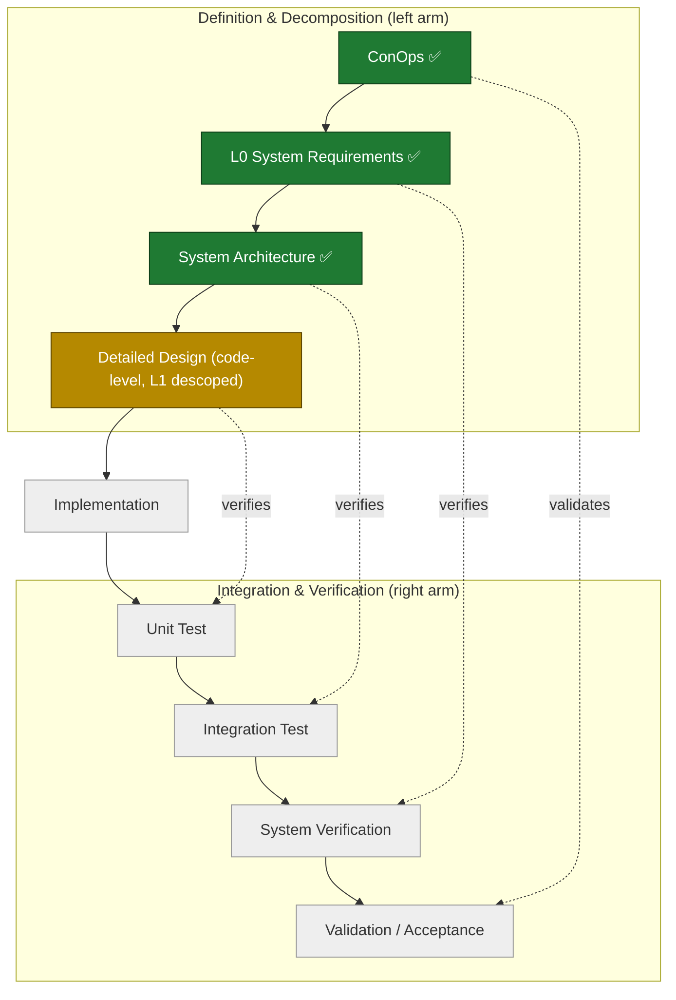

# V2.0 Systems Engineering "V" — Progress Tracker

## Purpose
This increment follows one systems-engineering "V" (see the Versioning note in the project `CLAUDE.md`). This page is the at-a-glance map of the V and which rungs are complete. It is a reference, not a controlled artifact.

## The V

The dotted links are the point of the V: each left-arm rung is verified/validated by its horizontal counterpart on the right arm. Verification approaches are defined *as* the left-arm rung is written, and executed on the way up.

## Status

| Left-arm rung | Artifact | Status | Verified by (right arm) |
|---|---|---|---|
| Concept of Operations | [conops.md](conops.md) — v0.3 | ✅ Complete | Validation / Acceptance |
| System Requirements (L0) | [L0_requirements.md](L0_requirements.md) — v0.3.1, baselined | ✅ Complete (SE-reviewed) | System Verification |
| System Architecture | [architecture.md](architecture.md) — v0.1 (Sentinel-Spine) | ✅ Complete | Integration Test |
| Detailed Design (code-level; formal L1 descoped) | the source tree | ⬜ | Unit Test |
| Implementation (vertex) | — | ⬜ | — |
| Right arm (V&V approach) | [dev_test_plan.md](dev_test_plan.md) — v0.1 | ✅ Planned | — |

## Current position
Three left-arm rungs are complete. The **System Architecture** rung selected **Sentinel-Spine** from a five-candidate paradigm-divergent exploration (generate → adversarially judge → synthesize), verified the closure of the review findings, and allocated all 62 L0 requirements to components. Supporting artifact: [architecture_options.pdf](architecture_options.pdf) (the five-candidate option comparison). The full per-requirement allocation to Sentinel-Spine components is **Appendix A** of [architecture.md](architecture.md).

**L1 decision.** A formal L1 requirements specification is **descoped** as disproportionate for a single-developer research rig — the architecture's Appendix A already allocates every L0 requirement to a component, and the code is the detailed design. The deferred numeric bounds (the L0 Open Items) are instead pinned empirically during the test campaign and recorded in a values ledger (see [dev_test_plan.md](dev_test_plan.md) §6).

**Right arm — planned.** The verification/validation approach for all four right-arm rungs, the incremental build order, the three required hardening grafts (de-block the executor, spine-resident observation watchdog, first-class `reasoning_ready` overlap policy), and the de-risking spikes are defined in the **[Development & Test Plan](dev_test_plan.md)** (v0.1), including a 62-requirement verification matrix.

**Immediate next action: the edge-budget feasibility spike (L0-SIM-01).** Measure the perception pipeline + `llama-server` co-resident in the Jetson's 8 GB before committing to the build — it is the one open item that can invalidate the single-edge-box assumption and change the architecture ranking ([dev_test_plan.md](dev_test_plan.md) §3.1).
