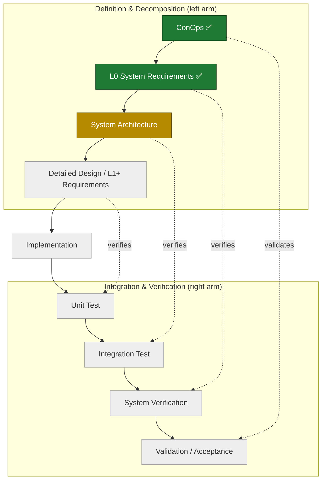

# V2.0 Systems Engineering "V" — Progress Tracker

## Purpose
This increment follows one systems-engineering "V" (see the Versioning note in the project `CLAUDE.md`). This page is the at-a-glance map of the V and which rungs are complete. It is a reference, not a controlled artifact.

## The V

The dotted links are the point of the V: each left-arm rung is verified/validated by its horizontal counterpart on the right arm. Verification approaches are defined *as* the left-arm rung is written, and executed on the way up.

## Status

| Left-arm rung | Artifact | Status | Verified by (right arm) |
|---|---|---|---|
| Concept of Operations | [conops.md](conops.md) — v0.3 | ✅ Complete | Validation / Acceptance |
| System Requirements (L0) | [L0_requirements.md](L0_requirements.md) — v0.3.1, baselined | ✅ Complete (SE-reviewed) | System Verification |
| System Architecture | — | ⬜ **Next** | Integration Test |
| Detailed Design / L1+ Requirements | — | ⬜ | Unit Test |
| Implementation (vertex) | — | ⬜ | — |

## Current position
Both left-arm rungs through L0 are complete. **L0 (62 requirements, 12 categories)** was put through a multi-agent SE review (dimensional fan-out → adversarial verify → synthesis) and a closure pass; all findings were resolved and it is baselined at v0.3.1 with full ConOps traceability.

**Next rung: System Architecture** — decompose the autonomy stack into components and allocate the L0 requirements to them. This is where the deferred design decisions (registry location / IPC boundary, gimbal command path, frame transport) are made — now properly downstream of a reviewed requirements baseline.
