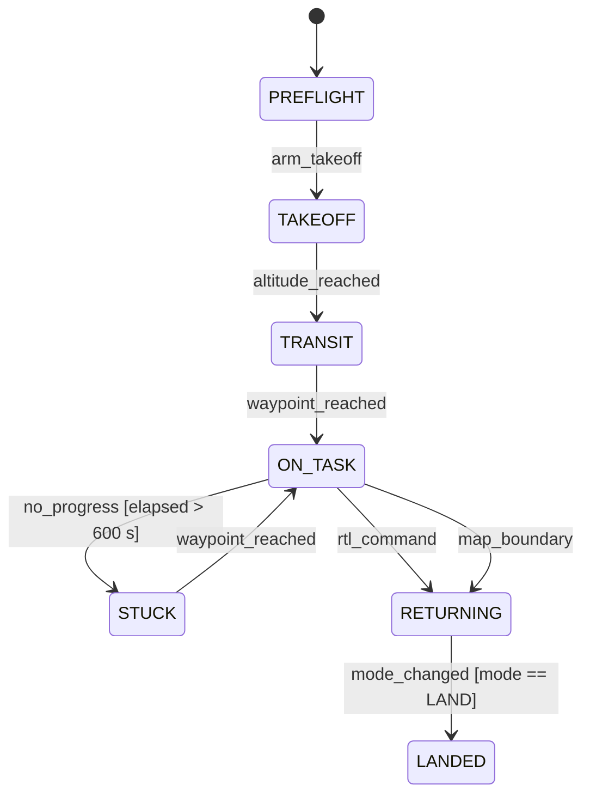

<!-- GENERATED by mbase render — do not edit. Edit model/ and regenerate. -->

# Mission state machine

`BHV-mission-fsm`

| kind | status | conformance_level |
|---|---|---|
| behavior | draft | structural |

Event-driven finite state machine that drives the mission lifecycle. The VLM (planner) is called only at decision-point events, not on a timer. STUCK is the only recovery state; all paths terminate in RETURNING or LANDED.

**Behavior type:** state_machine · **allocated to:** [CMP-mission-computer](../../system/CMP-mission-computer/README.md)

State Transition View in context: [CMP-mission-computer / state-BHV-mission-fsm](../../system/CMP-mission-computer/views/state-BHV-mission-fsm.md)

**Invariants**

- `state == LANDED implies armed == false`

**Properties**

- safety: `never transitions directly from PREFLIGHT to LANDED`
- liveness: `eventually reaches LANDED or RETURNING from any reachable state`

## Trace

| relationship | elements |
|---|---|
| satisfies | [REQ-event-driven-planning](../requirements/REQ-event-driven-planning.md), [REQ-fsm-bounded](../requirements/REQ-fsm-bounded.md) |
| allocated_to | [CMP-mission-computer](../../system/CMP-mission-computer/README.md) |

[← model home](../../README.md)
