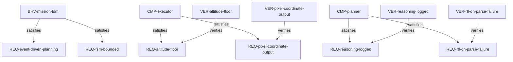

<!-- GENERATED by mbase render — do not edit. Edit model/ and regenerate. -->
# Requirements trace

```mermaid
graph TD
    BHV-mission-fsm["BHV-mission-fsm"]
    CMP-executor["CMP-executor"]
    CMP-planner["CMP-planner"]
    REQ-altitude-floor["REQ-altitude-floor"]
    REQ-event-driven-planning["REQ-event-driven-planning"]
    REQ-fsm-bounded["REQ-fsm-bounded"]
    REQ-pixel-coordinate-output["REQ-pixel-coordinate-output"]
    REQ-reasoning-logged["REQ-reasoning-logged"]
    REQ-rtl-on-parse-failure["REQ-rtl-on-parse-failure"]
    VER-altitude-floor["VER-altitude-floor"]
    VER-pixel-coordinate-output["VER-pixel-coordinate-output"]
    VER-reasoning-logged["VER-reasoning-logged"]
    VER-rtl-on-parse-failure["VER-rtl-on-parse-failure"]
    BHV-mission-fsm -- satisfies --> REQ-event-driven-planning
    BHV-mission-fsm -- satisfies --> REQ-fsm-bounded
    CMP-executor -- satisfies --> REQ-altitude-floor
    CMP-executor -- satisfies --> REQ-pixel-coordinate-output
    CMP-planner -- satisfies --> REQ-reasoning-logged
    CMP-planner -- satisfies --> REQ-rtl-on-parse-failure
    VER-altitude-floor -- verifies --> REQ-altitude-floor
    VER-pixel-coordinate-output -- verifies --> REQ-pixel-coordinate-output
    VER-reasoning-logged -- verifies --> REQ-reasoning-logged
    VER-rtl-on-parse-failure -- verifies --> REQ-rtl-on-parse-failure
```

Full matrix: [verification-matrix](./verification-matrix.md)
