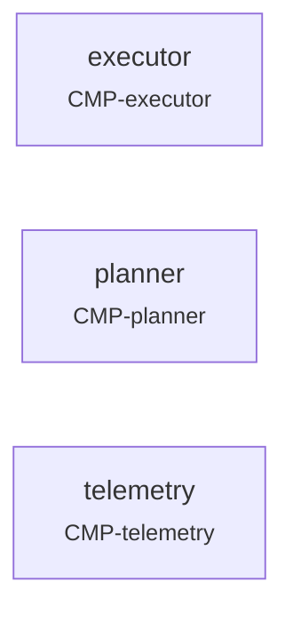

<!-- GENERATED by mbase render — do not edit. Edit model/ and regenerate. -->

[CMP-mission-computer](README.md) *(system)*

# Mission computer

`CMP-mission-computer`

| kind | status | conformance_level | level |
|---|---|---|---|
| component | draft | structural | system |

The LLM-UAV mission manager package running on Penny Royal (Jetson Orin Nano Super 8GB). Manages the full autonomous mission lifecycle: starts ArduPlane SITL, connects via MAVLink, arms and launches the aircraft, runs the event-driven planning loop until the aircraft lands, and archives the mission log. V1.0 baseline — frozen as of git tag v1.0.

## Views

- [Interconnection View — parts and wiring](./views/interconnection.md)
- [Browser View — composition below this node](./views/tree.md)
- [State Transition View — Mission state machine](./views/state-BHV-mission-fsm.md)
- [Grid View — requirements in this branch](./requirements.md)
- [Grid View — V&V events and outcomes](./verification.md)

## Structure

### Parts

- **executor** → [CMP-executor](CMP-executor/README.md)
- **planner** → [CMP-planner](CMP-planner/README.md)
- **telemetry** → [CMP-telemetry](CMP-telemetry/README.md)

## Trace

| relationship | elements |
|---|---|
| children | [CMP-executor](CMP-executor/README.md), [CMP-planner](CMP-planner/README.md), [CMP-telemetry](CMP-telemetry/README.md) |
| behaviors | [BHV-mission-fsm](../../elements/behaviors/BHV-mission-fsm.md) |
| events scoped here | [VAL-mission-002-boundary-pattern](../../elements/validation/VAL-mission-002-boundary-pattern.md) |

[← model home](../../README.md)
