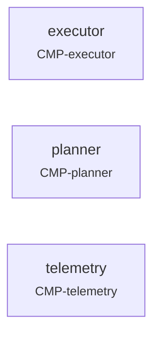

<!-- GENERATED by mbase render — do not edit. Edit model/ and regenerate. -->

[CMP-mission-computer](../README.md) *(system)*

# Mission computer — Interconnection View

### Parts

- **executor** → [CMP-executor](../CMP-executor/README.md)
- **planner** → [CMP-planner](../CMP-planner/README.md)
- **telemetry** → [CMP-telemetry](../CMP-telemetry/README.md)

[← model home](../../../README.md)
