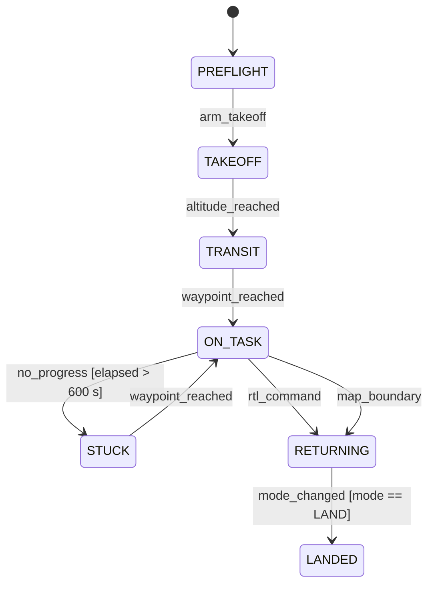

<!-- GENERATED by mbase render — do not edit. Edit model/ and regenerate. -->

[CMP-mission-computer](../README.md) *(system)*

# Mission computer — State Transition View — Mission state machine

Behavior: [BHV-mission-fsm](../../../elements/behaviors/BHV-mission-fsm.md)

[← model home](../../../README.md)
